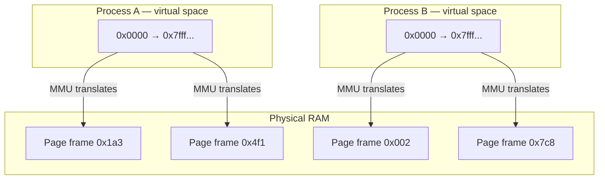
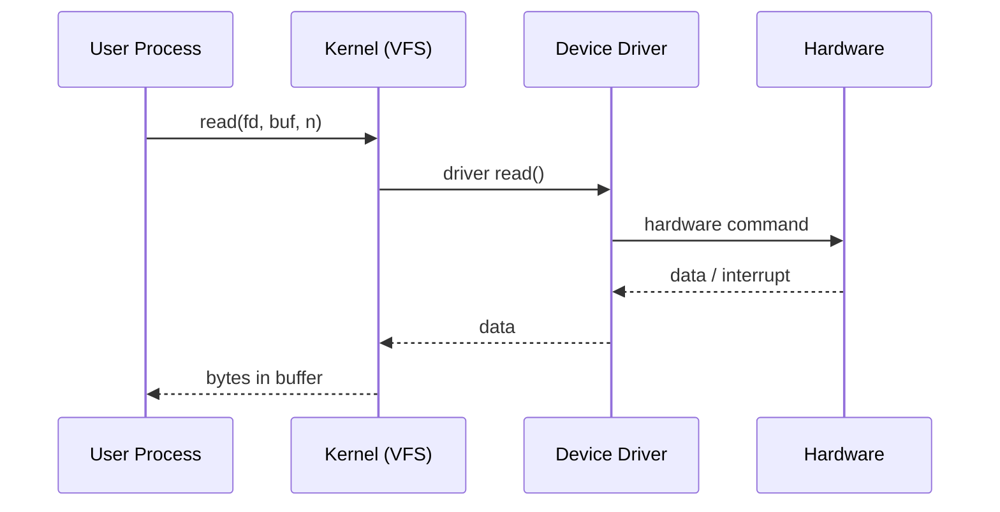

# Kernel: Process Management, Memory Management, Device Drivers

The kernel isn't a program that runs. It's the thing everything else runs on top of. It doesn't sit in a loop waiting — it gets invoked: a process makes a syscall, a timer fires, a hardware interrupt arrives. In between, it's just sitting in memory while your processes run.

## Process management

The kernel tracks every process in a structure called `task_struct`. It holds everything needed to manage that process — PID, current state, open file descriptors, memory mappings, credentials, and a saved snapshot of CPU registers for when the process isn't running.

| Field | What it holds |
|---|---|
| PID | process ID |
| State | running / sleeping / stopped / zombie |
| File descriptors | open files |
| Memory maps | virtual address space layout |
| Credentials | UID, GID |
| Saved CPU state | registers, for when it's off-CPU |

The scheduler (CFS — Completely Fair Scheduler — by default) picks who runs next based on how much CPU time each process has gotten relative to its weight. When it switches, that's a context switch: save the current process's registers, restore the next process's, jump to where it left off. This happens fast enough — microseconds — that from a human perspective everything runs simultaneously. It doesn't; it just takes turns very quickly.

## Memory management

Every process gets its own virtual address space. It looks like a contiguous block of memory starting near 0x0, and the process has no idea what's actually happening underneath. Physical RAM is shared across all processes, fragmented, possibly partially swapped to disk — the kernel uses page tables to maintain the illusion of private contiguous memory for each one.

The CPU's MMU does the translation on every memory access using those tables. When a process touches a page that isn't in RAM, the kernel handles the page fault — finds the data, loads it into a free physical page, updates the table, resumes the process. The program never knows it happened.

Memory protection is a side effect of this design. Each process has its own page tables pointing to its own pages. There's no path from process A's address space into process B's — the mappings simply don't exist.

## Device drivers

Hardware doesn't speak the kernel's language. A driver is the translation layer — it knows how to talk to one specific piece of hardware and exposes a standard interface upward. Block device drivers expose read and write. Network drivers handle packet TX and RX. The rest of the kernel doesn't know or care what's underneath.

## Monolithic kernel, loadable modules

Linux is monolithic: the scheduler, memory manager, filesystems, network stack, and drivers all live in one block of privileged code. The upside is performance — no context switching between subsystems, no message passing overhead. The downside is that a bad bug anywhere in that block can take down the whole system.

The contrast is a microkernel like Mach or QNX, where most subsystems run as separate user-space processes communicating via IPC. More fault-isolated, but the overhead is real.

Linux's compromise is loadable kernel modules. You can compile a driver separately and load it at runtime with `modprobe` without rebuilding the kernel. But don't mistake this for safety — modules run in ring 0 with full kernel privileges. A broken module panics the system the same as a bug in core kernel code.

## exam-note

> [!exam] LFCA
> Three kernel jobs: **process management** (scheduling, context switching), **memory management** (virtual memory, page tables), **device drivers** (hardware abstraction). Linux = monolithic with loadable modules. Not a microkernel. Kernel runs ring 0, user processes ring 3.

## Related

- [[levels-of-abstraction]]
- [[system-calls]]
- [[user-space-vs-kernel-space]]
