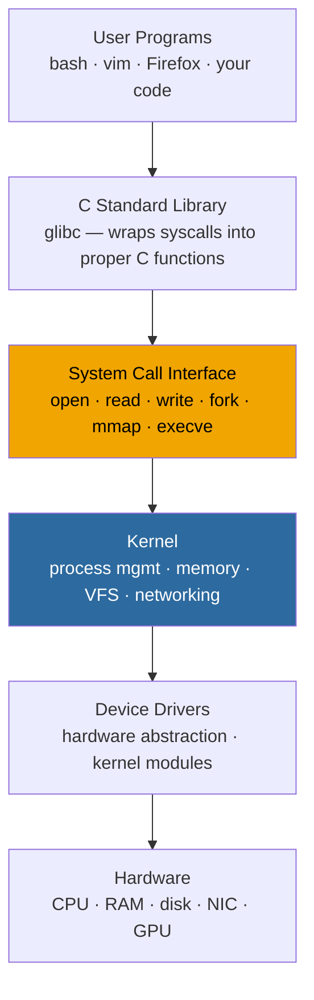
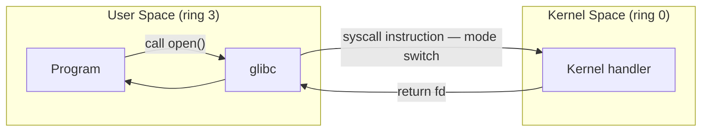

# Levels and Layers of Abstraction in a Linux System

The reason you can call `write()` in a program and have it work on any Linux machine — regardless of what disk is underneath, what filesystem is mounted, whether it's writing to a pipe or a file or a socket — is that every layer in the stack only talks to the layer directly below it. Your program never knows what hardware it's running on. That's the point.

The system call interface is the line that actually matters. Above it is user space. Below it is kernel space. Everything about how Linux keeps processes isolated from each other and from hardware comes down to that line holding.

User-space code runs at CPU ring 3. Instructions that touch hardware require ring 0. If your program tries to access a hardware port or a physical memory address it doesn't own, the CPU raises a fault before anything happens. The kernel catches it, kills the process. Not a policy someone wrote down — the silicon does it.

To cross legitimately, you go through a system call: the program puts a syscall number in a register, executes the `syscall` instruction, and the CPU hands control to the kernel. The kernel does the work. Control comes back. The user program was never in ring 0 — it just waited.

The payoff of all this: a crash in user space is completely contained. The crashed process never had direct access to hardware or other processes' memory, so there's nothing it could have taken with it on the way down.

## exam-note

> [!exam] LFCA
> Stack order: hardware → kernel → system calls → libraries → user programs. User/kernel separation is enforced by CPU privilege rings. System calls are the only sanctioned crossing point.

## Related

- [[kernel-overview]]
- [[user-space-vs-kernel-space]]
- [[system-calls]]
