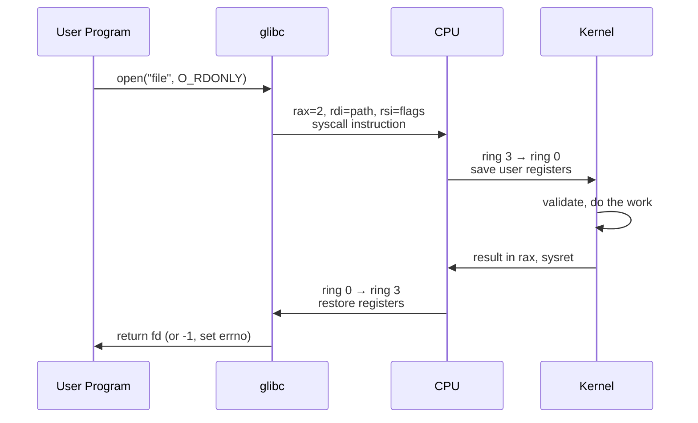

# System Calls and Support

Every time a program opens a file, allocates memory, forks a child process, or sends a packet — it's making a system call. There's no other way for user-space code to get the kernel to do anything. Syscalls are the entire interface between the two worlds.

## What actually happens during a syscall

The program puts the syscall number in `rax`, arguments in other registers (`rdi`, `rsi`, `rdx`...), and executes the `syscall` instruction. That instruction causes a CPU trap: execution switches to ring 0, the user-space registers are saved, and the kernel's syscall dispatcher looks up the handler by number and runs it. On return, the result goes into `rax`, the registers are restored, and the program continues from the next instruction. The whole thing takes microseconds.



Every syscall has a number. On x86-64: `read`=0, `write`=1, `open`=2, `fork`=57, `execve`=59. The kernel has a table. The number is an index into that table.

## The syscalls worth knowing

| Syscall | What it does |
|---|---|
| `open(path, flags)` | Opens a file, returns a file descriptor |
| `read(fd, buf, n)` | Reads up to n bytes from fd |
| `write(fd, buf, n)` | Writes n bytes to fd |
| `close(fd)` | Releases the file descriptor |
| `fork()` | Copies the current process. Returns 0 in child, child's PID in parent |
| `execve(path, argv, envp)` | Replaces the process image with a new program |
| `mmap(...)` | Maps memory into address space — this is what `malloc` calls eventually |
| `exit(status)` | Terminates the process |

The fork+exec pattern is how every new program gets launched. The shell forks itself, gets a child process, and calls `execve` in the child to replace it with whatever you typed. The original shell sits there waiting with `wait()`.

## glibc

You almost never call syscalls directly. glibc wraps all of them — proper C functions, error handling, sets `errno` on failure, returns something sensible. `fopen()` calls `open`. `malloc()` eventually calls `mmap` or `brk`. Python, Ruby, Go — their runtimes are all sitting on top of the same foundation.

You *can* call syscalls directly using the `syscall()` wrapper in `<unistd.h>` or with inline assembly. It works. It's just non-portable and annoying, and you're giving up everything the library does for you.

## strace

`strace` shows you every syscall a process makes, with arguments and return values. It's one of the better debugging tools on Linux because it's honest — it shows you what the program is actually doing, not what the source code claims it's doing.

```bash
strace ls /tmp

# only care about file opens
strace -e trace=openat ls /tmp

# attach to something already running
strace -p 1234

# get a summary with counts and time
strace -c ls /tmp
```

Run `strace` on something simple like `ls` and actually read the output. Before `main()` even runs, you'll see the dynamic linker opening `/etc/ld.so.cache`, loading shared libraries, glibc initializing. It changes how you think about what a "running program" actually is.

## exam-note

> [!exam] LFCA
> Syscalls are the user→kernel interface. Know the common ones: `open`, `read`, `write`, `fork`, `execve`. glibc wraps them. `strace` traces live syscall activity on a process.

## Related

- [[levels-of-abstraction]]
- [[kernel-overview]]
- [[user-space-vs-kernel-space]]
