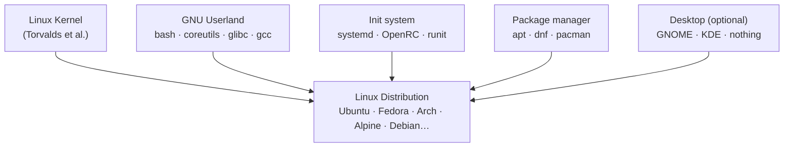

# UNIX, MINIX, Distros

The reason your shell prompt looks the way it does, the reason `ls` and `grep` work the way they work, the reason there's a file at `/etc/passwd` — all of it traces back to decisions made at Bell Labs in the early 1970s by a small group of people building something for themselves. That's not trivia. It explains why the system is the way it is.

## Bell Labs

Ken Thompson and Dennis Ritchie started Unix around 1969. They were building an environment where they could actually work — write programs, run them, share them between machines. The big computing systems of the time were locked-down batch-processing monsters. Unix was the opposite: small, interactive, programmable.

Most of what feels "natural" about Linux today came directly from this period. The filesystem hierarchy. Everything as a file — devices, sockets, pipes, all accessed through the same read/write interface. The shell as a user program, not a privileged part of the OS. Small tools that do one thing and compose through pipes. Ritchie designed C specifically to implement Unix, and the two evolved together.

None of this was planned as a philosophy. It was engineering decisions made by people who had to live with the consequences. They wanted something that worked and stayed out of their way.

AT&T licensed Unix commercially in the late 70s. Berkeley took it and added significant things — notably TCP/IP networking, which is why BSD is in the lineage of basically every networked system today. The Unix tree forked: System V from AT&T, BSD from Berkeley, and a growing list of vendor variants (HP-UX, AIX, SunOS, IRIX). They shared heritage but diverged enough that code written for one didn't necessarily run on another. POSIX existed because this got bad enough that someone needed to write down the common interface.

## Minix and the 386

By the late 1980s, Unix source code was expensive and proprietary. A computer science professor named Andrew Tanenbaum wrote MINIX — a minimal Unix-like OS for teaching, shipped with a textbook. Clean design, ran on the IBM PC, not meant for production.

In 1991, a Finnish student named Linus Torvalds was running MINIX and frustrated with its limitations. He started writing his own kernel, mostly to learn how his 386 processor worked. In August 1991 he announced it on the comp.os.minix newsgroup:

> *"I'm doing a (free) operating system (just a hobby, won't be big and professional like gnu) for 386(486) AT clones."*

What he didn't fully account for: Richard Stallman had spent most of the 1980s building a complete free Unix replacement under the GNU project. GCC, bash, coreutils, glibc — every part of the userland was done or close to done. The one missing piece was a free kernel. GNU's own kernel project (Hurd) had been stuck for years.

Linux dropped into that gap at the right moment. Torvalds released under the GPL, people contributed, and the combination of the Linux kernel and GNU userland gave the world a complete, free, working operating system. The name GNU/Linux is technically more accurate than just "Linux" — Stallman will tell you this at length — but in practice nobody says GNU/Linux except in formal contexts.

## What a distribution is

The Linux kernel is just a kernel. You can't use a kernel by itself — you need a shell, basic utilities, an init system, a way to install software. A distribution packages all of that together into something installable.

The kernel is the common part. Linus still maintains it. Distributions take a kernel release, sometimes with patches, and package it with everything else. When your friend says they "use Linux," they mean they use a distribution. The kernel is just one layer of it.

## Why so many distros

Because it's open source and anyone can make one, but also because there are genuinely different needs. The differences that actually matter:

| Distro | What it's actually for |
|---|---|
| Debian | Stability over cutting-edge; strong free software policy |
| Ubuntu | Debian base with more polish and a reliable release schedule |
| Fedora | Close to upstream, bleeds a bit — good for developers |
| RHEL / Rocky / AlmaLinux | Long-term support for production servers; Red Hat sells the support |
| Arch | Minimal base; you assemble it yourself; rolling releases |
| Alpine | Tiny footprint; musl instead of glibc; built for containers |
| Gentoo | Everything compiled from source; extremely configurable |

Underneath all of them: the same kernel, the same syscall interface, the same GNU tools in most cases. A shell script written to POSIX will run on all of them. The differences mostly live in the package ecosystem and default configuration, not in the fundamentals.

## POSIX

POSIX (Portable Operating System Interface) is an IEEE standard that defines what a compliant Unix-like system must provide: the C API, the behavior of the shell, the semantics of standard utilities. It was written because the Unix family had diverged badly enough to make software portability genuinely painful.

Linux isn't officially POSIX certified — getting certified costs money and requires a formal process nobody has bothered with. But it's compliant enough in practice that POSIX-written code runs on Linux, macOS, BSDs, and AIX without modification. When you see something documented as a "GNU extension" or "Linux-specific," that's the marker that you're outside the portable subset.

## exam-note

> [!exam] LFCA
> Unix origin: Bell Labs, Thompson and Ritchie, ~1969. Linux = kernel (Torvalds, 1991) + GNU userland (Stallman's project). A distribution is the kernel plus everything else packaged together. POSIX defines the portable interface across Unix-like systems — Linux is largely compliant but not formally certified.

## Related

- [[levels-of-abstraction]]
- [[kernel-overview]]
