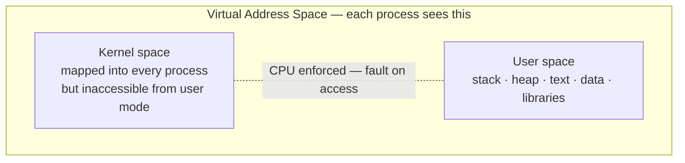
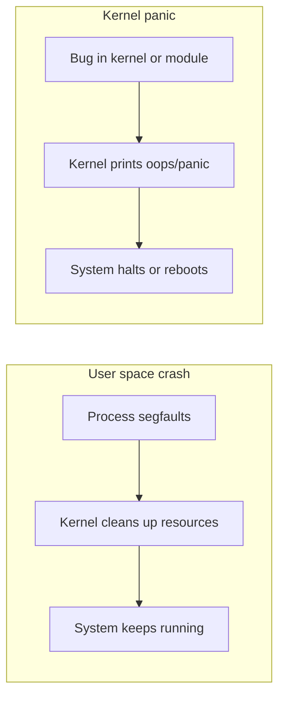

# User Space vs Kernel Space

This is the split that makes the rest of the system possible. Without it, any buggy program could corrupt kernel memory, write to hardware directly, or take down the whole machine. With it, processes are isolated from each other and from the kernel by the CPU itself.

## The memory layout

On x86-64, the virtual address space is divided: the lower portion belongs to user processes, the upper portion to the kernel. The kernel is mapped into the top of every process's address space — it has to be there to handle syscalls quickly without switching address spaces — but those pages are marked inaccessible from user mode. Reading or executing a kernel address from user space causes an immediate CPU fault.

Worth noting: Spectre/Meltdown changed this somewhat. KPTI (Kernel Page Table Isolation) now keeps separate page tables for user and kernel mode on vulnerable CPUs, adding a more complete separation at a small performance cost. But conceptually the model is the same.

## What isolation actually means in practice

A process running in user space can't access hardware ports, can't read physical memory, can't touch another process's pages — not because the kernel is checking every memory access, but because the page tables simply don't contain those mappings. The hardware enforces it at the MMU level.

If a process tries anyway — executing a privileged instruction, dereferencing a pointer it doesn't own — the CPU raises a fault. The kernel catches it, sends `SIGSEGV` or `SIGILL` to the offending process, and the process dies. The kernel logs it if you're watching, and moves on.

This is why a segfault doesn't take down your system. The crashed process never had the access that would have let it do real damage.

## Kernel panic

Kernel space has no such safety net. When a bug occurs in kernel code — a null pointer dereference in a driver, a corrupted data structure, hardware returning something the kernel can't make sense of — there's nothing above it to catch the fault. The kernel prints a panic message and halts.

A user-space segfault is boring. A kernel panic means the system is gone until reboot. This is the practical reason kernel code is reviewed more carefully than application code, and why running untrusted code in kernel space (like a sketchy module) is a real risk.

## exam-note

> [!exam] LFCA
> CPU privilege rings enforce the boundary. User-space crashes are isolated — other processes continue. Kernel panics halt the entire system. System calls are the only sanctioned crossing point.

## Related

- [[levels-of-abstraction]]
- [[kernel-overview]]
- [[system-calls]]
