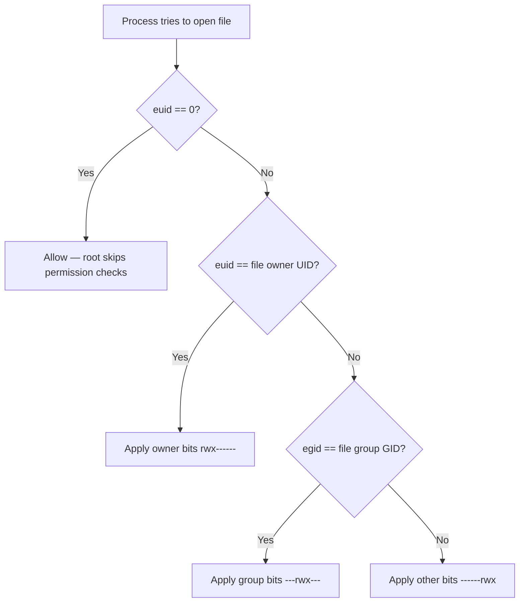

# Users

The kernel has never heard of `valen`. It knows UID 1000. All permission decisions — who can read this file, who can kill that process, who can bind to this port — are made on numbers, not names. The mapping from names to numbers in `/etc/passwd` is purely for human consumption; the kernel never touches it.

## UIDs and what the kernel tracks

Every process carries three UIDs:

| UID type | Purpose |
|---|---|
| Real UID (ruid) | Who owns this process |
| Effective UID (euid) | What permissions it actually runs with — this is what the kernel checks |
| Saved UID (suid) | Allows controlled transitions back to a previous privilege level |

Most of the time all three are the same. They come apart when a setuid binary runs — `sudo` is the obvious example — or when a process deliberately drops privileges.

## Root is just UID 0

There's no special kernel mode for root. Root is a UID, hardcoded as 0, and the kernel has conditionals scattered through it: `if (euid == 0) skip this check`. That's the whole thing. A root process can read any file, kill any process, load kernel modules, bind to privileged ports, `chroot`, `mount`, modify the system clock. All of those are just checks that UID 0 bypasses.

## How file permissions work

Every inode stores an owner UID, a group GID, and nine permission bits. When a process opens a file, the kernel walks a simple decision tree:

The same logic applies to signals: sending `SIGKILL` to a process you don't own gets refused unless you're root.

## sudo and why it's different from being root

`sudo` is a setuid binary — when you execute it, its effective UID becomes 0 regardless of who's running it. It then checks `/etc/sudoers` to decide whether to actually let you run something as root. If yes, it runs the command. The whole thing is logged.

Running permanently as root is different. There's no logging, no friction, no per-command authorization. Every command runs with full privileges. Every typo, every script, every tool you invoke runs as root. The blast radius of a mistake is the entire system.

The principle of least privilege is the answer to this: run with only the access you actually need. It's why services have their own unprivileged users — `www-data`, `postgres`, `nobody`. If a web server process gets compromised, the attacker gets `www-data`'s access, which can't touch `/etc/shadow` or load kernel modules. That's the point.

## exam-note

> [!exam] LFCA
> Users = UIDs. Root = UID 0, hardcoded. The kernel checks effective UID for permission decisions. `sudo` gives temporary, logged root access per command. Principle of least privilege: run with minimum necessary permissions.

## Related

- [[user-space-vs-kernel-space]]
- [[kernel-overview]]
